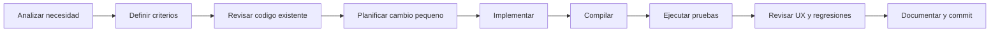

# Planificacion e implementacion de Mikuy

## Proposito

Este documento registra como un agente de codigo debe convertir requisitos en
cambios verificables sin romper reservas, PostgreSQL ni despliegue.

## Flujo de trabajo



## Plan del producto

### Fase 1: Reserva confiable

- Disponibilidad en tiempo real.
- Reserva en dos pasos.
- Validacion repetida en el servidor.
- Codigo unico y confirmacion clara.
- Consulta por codigo o contacto.

**Estado:** implementado.

### Fase 2: Cliente reconocido

- Registro opcional.
- Acceso por correo o telefono.
- Autocompletado mediante `Mikuy.ClienteId`.
- Salida del modo cliente desde la navegacion.

**Estado:** implementado con cookie; una cuenta autenticada completa queda como
mejora futura.

### Fase 3: Operacion administrativa

- Pendientes y agenda en el dashboard.
- Confirmacion y cancelacion rapida.
- Busqueda global.
- KPIs y semaforos operativos.
- Gestion de clientes, mesas y platos.

**Estado:** implementado.

### Fase 4: Persistencia y despliegue

- PostgreSQL con migraciones.
- Docker multi-stage.
- Variables de Railway.
- Migracion y seed al iniciar.

**Estado:** implementado; requiere variables correctas en cada entorno.

### Fase 5: Calidad continua

- Ampliar pruebas de integracion.
- Agregar pruebas end-to-end de reserva.
- Medir accesibilidad y rendimiento.
- Automatizar build y test en CI.

**Estado:** pendiente.

## Estrategia de implementacion

1. Localizar la capa propietaria del cambio.
2. Mantener controladores delgados.
3. Reutilizar DTOs, ViewModels y estilos existentes.
4. Validar en cliente solo para usabilidad; validar siempre en servidor.
5. Proteger reglas criticas tambien en PostgreSQL.
6. Agregar pruebas proporcionales al riesgo.
7. Ejecutar build y tests antes de entregar.

## Definicion de terminado

Una tarea se considera terminada cuando:

- Cumple sus criterios de aceptacion.
- No rompe los flujos de reserva publica ni administracion.
- Compila sin errores.
- Las pruebas automatizadas pasan.
- La interfaz funciona con teclado y en ancho movil.
- Los estados de carga, error y exito son comprensibles.
- No incluye secretos ni archivos generados.
- La documentacion afectada esta actualizada.

## Comandos de verificacion

```powershell
dotnet build Reserva.Web\Reserva.Web.csproj --no-restore
dotnet test Reserva.Tests\Reserva.Tests.csproj --no-restore --verbosity minimal
```

Para desarrollo local con PostgreSQL:

```powershell
docker compose up -d
dotnet run --project Reserva.Web\Reserva.Web.csproj --urls http://127.0.0.1:5089
```

## Registro de decisiones

| Decision | Motivo |
|---|---|
| PostgreSQL como base oficial | Integridad, Railway y soporte de indice parcial |
| ASP.NET Core MVC | Stack del proyecto y renderizado simple del servidor |
| Reserva en dos pasos | Reduce carga cognitiva |
| Registro no obligatorio | Reduce abandono |
| Codigo recuperable | No depender de la memoria del usuario |
| Confirmacion administrativa | Mantiene control operativo del restaurante |

