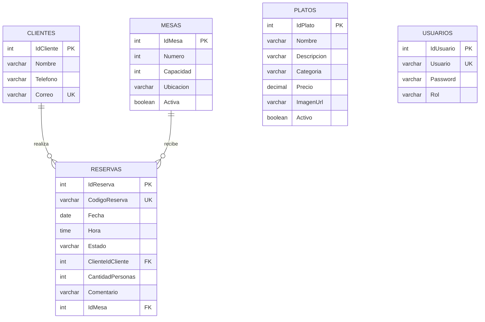

# Base de datos de Mikuy

## Motor y acceso

- Motor: PostgreSQL 16 o compatible.
- ORM: Entity Framework Core 10.
- Proveedor: Npgsql.
- Contexto: `ReservationDbContext`.
- Migraciones: `Reserva.Infrastructure/Persistence/Migrations/`.

## Modelo relacional



## Script PostgreSQL de referencia

El script resume el modelo vigente. En ejecucion real deben aplicarse las
migraciones de Entity Framework Core.

```sql
CREATE TABLE "Clientes" (
    "IdCliente" integer GENERATED BY DEFAULT AS IDENTITY PRIMARY KEY,
    "Nombre" varchar(100) NOT NULL,
    "Telefono" varchar(20) NOT NULL,
    "Correo" varchar(150) NOT NULL
);

CREATE UNIQUE INDEX "IX_Clientes_Correo"
    ON "Clientes" ("Correo");

CREATE INDEX "IX_Clientes_Telefono"
    ON "Clientes" ("Telefono");

CREATE TABLE "Mesas" (
    "IdMesa" integer GENERATED BY DEFAULT AS IDENTITY PRIMARY KEY,
    "Numero" integer NOT NULL,
    "Capacidad" integer NOT NULL,
    "Ubicacion" varchar(80) NOT NULL,
    "Activa" boolean NOT NULL DEFAULT TRUE
);

CREATE INDEX "IX_Mesas_Numero"
    ON "Mesas" ("Numero");

CREATE TABLE "Platos" (
    "IdPlato" integer GENERATED BY DEFAULT AS IDENTITY PRIMARY KEY,
    "Nombre" varchar(120) NOT NULL,
    "Descripcion" varchar(320) NOT NULL,
    "Categoria" varchar(60) NOT NULL,
    "Precio" decimal(8,2) NOT NULL,
    "ImagenUrl" varchar(220) NOT NULL,
    "Activo" boolean NOT NULL DEFAULT TRUE
);

CREATE TABLE "Usuarios" (
    "IdUsuario" integer GENERATED BY DEFAULT AS IDENTITY PRIMARY KEY,
    "Usuario" varchar(50) NOT NULL,
    "Password" varchar(200) NOT NULL,
    "Rol" varchar(30) NOT NULL
);

CREATE UNIQUE INDEX "IX_Usuarios_Usuario"
    ON "Usuarios" ("Usuario");

CREATE TABLE "Reservas" (
    "IdReserva" integer GENERATED BY DEFAULT AS IDENTITY PRIMARY KEY,
    "CodigoReserva" varchar(24) NOT NULL,
    "Fecha" date NOT NULL,
    "Hora" time(0) without time zone NOT NULL,
    "Estado" varchar(30) NOT NULL DEFAULT 'Pendiente',
    "ClienteIdCliente" integer NOT NULL,
    "CantidadPersonas" integer NOT NULL,
    "Comentario" varchar(300),
    "IdMesa" integer NOT NULL,
    CONSTRAINT "CK_Reservas_Estado"
        CHECK ("Estado" IN ('Pendiente', 'Confirmada', 'Cancelada')),
    CONSTRAINT "FK_Reservas_Clientes"
        FOREIGN KEY ("ClienteIdCliente")
        REFERENCES "Clientes" ("IdCliente")
        ON DELETE RESTRICT,
    CONSTRAINT "FK_Reservas_Mesas"
        FOREIGN KEY ("IdMesa")
        REFERENCES "Mesas" ("IdMesa")
        ON DELETE RESTRICT
);

CREATE UNIQUE INDEX "IX_Reservas_CodigoReserva"
    ON "Reservas" ("CodigoReserva");

CREATE INDEX "IX_Reservas_Estado"
    ON "Reservas" ("Estado");

CREATE UNIQUE INDEX "UX_Reservas_Mesa_Fecha_Hora"
    ON "Reservas" ("IdMesa", "Fecha", "Hora")
    WHERE "Estado" <> 'Cancelada';
```

## Integridad y seguridad

- Las claves foraneas usan `ON DELETE RESTRICT`.
- El indice parcial evita reservar la misma mesa dos veces.
- El estado se protege mediante `CHECK`.
- Los datos sensibles no deben almacenarse en archivos versionados.
- `Password` contiene un hash, nunca la contrasena en texto plano.
- Railway debe inyectar `DATABASE_URL` o las variables `PG*`.

## Migraciones

```powershell
dotnet ef database update `
  --project Reserva.Infrastructure\Reserva.Infrastructure.csproj `
  --startup-project Reserva.Web\Reserva.Web.csproj
```

