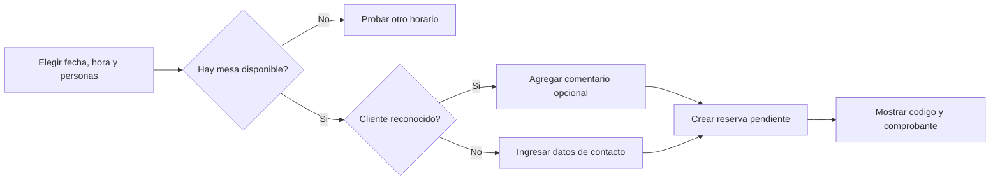
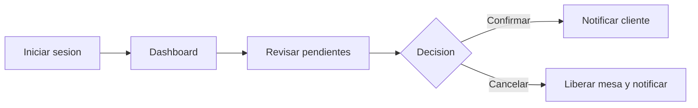

# Diseno del sistema Mikuy

Este documento resume las decisiones de producto y enlaza los artefactos
tecnicos del proyecto.

## Objetivos de diseno

1. Resolver la reserva con el menor esfuerzo posible.
2. Dar respuesta inmediata antes de pedir datos personales.
3. Mantener una identidad visual calida vinculada con Ayacucho.
4. Priorizar las tareas operativas del administrador.
5. Hacer visibles los estados del sistema: carga, exito, error y vacio.

## Principios de experiencia

- **Disponibilidad primero:** fecha, hora y personas preceden al contacto.
- **Divulgacion progresiva:** cada pantalla muestra solo la informacion necesaria.
- **Reconocimiento antes que recuerdo:** el codigo se guarda y puede recuperarse.
- **Consistencia:** los estados usan el mismo nombre y color en cliente y
  administracion.
- **Accion clara:** cada vista tiene una accion principal identificable.
- **Retroalimentacion:** toda accion asincrona comunica que esta ocurriendo.

## Sistema visual

| Elemento | Uso |
|---|---|
| Marron oscuro | Navegacion, fondos de marca y contraste |
| Terracota | Acciones principales y acentos |
| Crema calido | Superficies de contenido |
| Verde | Disponibilidad, confirmacion y operacion normal |
| Ambar | Pendientes y advertencias |
| Rojo | Cancelacion, error y capacidad critica |

La interfaz evita superficies blancas puras y capsulas decorativas innecesarias.
Los enlaces activos se reconocen mediante linea inferior, peso tipografico y
contraste. Las animaciones respetan `prefers-reduced-motion`.

## Flujos principales

### Reserva publica

### Operacion administrativa

## Componentes de interfaz

- Navbar publica con seccion activa y estado del restaurante.
- Hero de marca con llamada principal a reservar.
- Tarjetas de platos y contenido con microinteracciones discretas.
- Formulario de reserva en dos pasos.
- Paneles de disponibilidad y confirmacion.
- Consulta de reserva por codigo o contacto.
- Dashboard con buscador, semaforos, KPIs, pendientes y agenda.
- Tablas administrativas adaptables y dialogos de confirmacion.
- Toasts para exito y error.

## Artefactos relacionados

- [Analisis funcional](analisis.md)
- [Base de datos](BD.md)
- [Arquitectura](arquitectura.md)
- [Prototipo y tecnologias](Desing.md)
- [Planificacion e implementacion](AgenteCod.md)
- [Estrategia de pruebas](pruebas.md)

