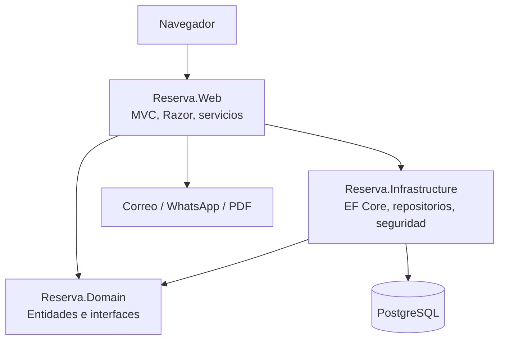
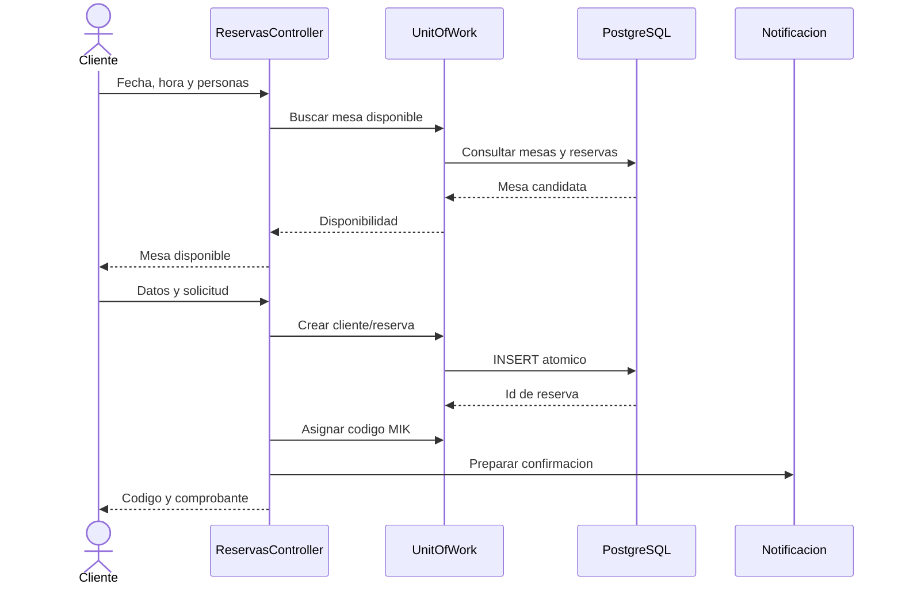
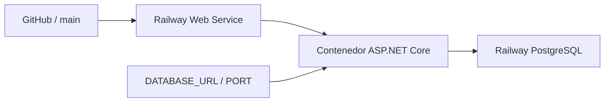

# Arquitectura de Mikuy

## Estilo

Mikuy usa una arquitectura por capas sobre ASP.NET Core MVC. Las dependencias
apuntan desde la presentacion hacia abstracciones y persistencia controlada.

## Capas

### Reserva.Domain

Contiene las entidades `Cliente`, `Reserva`, `Mesa`, `Plato` y `Usuario`, las
validaciones fundamentales, estados permitidos e interfaces de repositorio.
No depende de ASP.NET Core ni de PostgreSQL.

### Reserva.Infrastructure

Implementa `ReservationDbContext`, repositorios, unidad de trabajo, migraciones,
datos iniciales y hash de contrasenas. Traduce el modelo del dominio a
PostgreSQL mediante Entity Framework Core y Npgsql.

### Reserva.Web

Expone controladores MVC, vistas Razor, DTOs, ViewModels, servicios de
notificacion y comprobantes. `Program.cs` configura autenticacion, inyeccion de
dependencias, conexion, migraciones y rutas.

### Reserva.Tests

Valida modelos, controladores, reglas de negocio y seguridad con MSTest y Moq.

## Modulos funcionales

| Modulo | Responsabilidad |
|---|---|
| Home | Inicio, cultura, contacto y platos destacados |
| Reservas | Disponibilidad, reserva, consulta, cancelacion y comprobante |
| Clientes | Registro, reconocimiento y gestion administrativa |
| Mesas | Capacidad y disponibilidad fisica |
| Platos | Catalogo publico y mantenimiento |
| Admin | Dashboard, KPIs, agenda y cambio de estado |
| Cuenta | Inicio y cierre de sesion administrativa |

## Flujo de una reserva

## Despliegue

El `Dockerfile` realiza compilacion multi-stage. La aplicacion lee `PORT` y la
conexion PostgreSQL desde variables de entorno. Al iniciar aplica migraciones y
datos iniciales.

## Decisiones relevantes

- MVC y Razor reducen complejidad para una aplicacion administrativa compacta.
- PostgreSQL garantiza integridad incluso ante solicitudes concurrentes.
- La autenticacion administrativa usa cookies.
- El reconocimiento del cliente usa una cookie independiente y no sustituye
  una cuenta con autenticacion completa.
- Los comprobantes se generan en el servidor.

